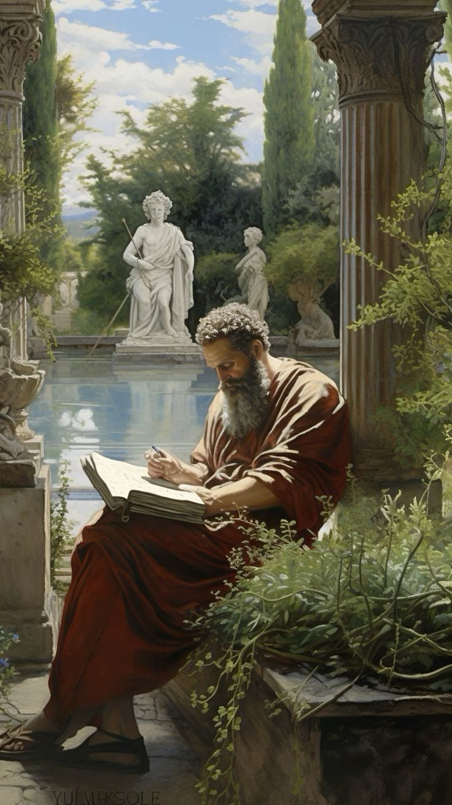
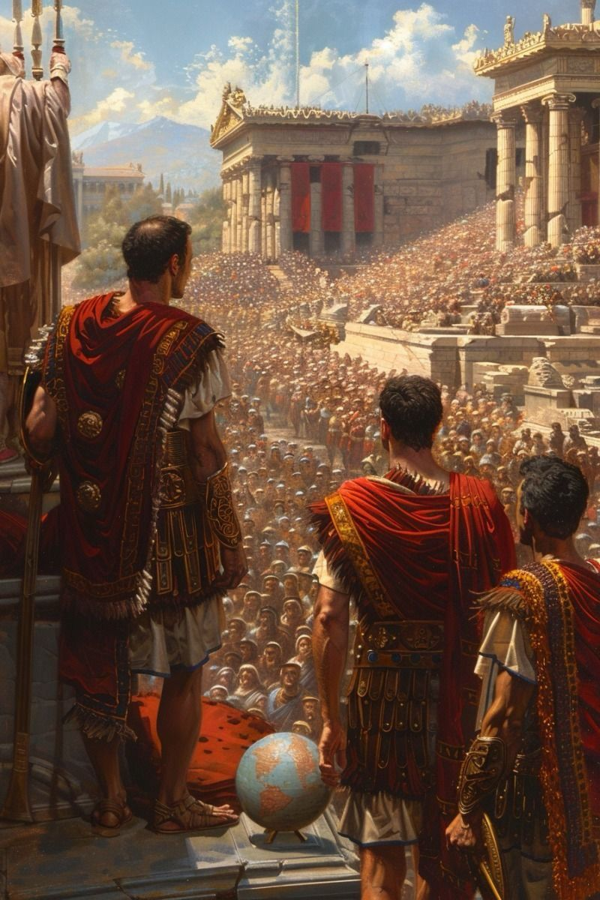

# Periódico Digital - Antigua Roma

## Descripción
Este es un sitio web en HTML que simula un periódico digital ambientado en la Antigua Roma. Presenta entrevistas ficticias con personajes históricos, noticias sobre la época, una sección de opinión y una conclusión que reflexiona sobre el futuro de la República Romana.

## Características
- **Diseño atractivo:** Uso de la tipografía "Merriweather" para dar un estilo clásico.
- **Interactividad:** Secciones expandibles con JavaScript.
- **Contenido histórico:** Noticias, entrevistas y artículos basados en la historia de Roma.
- **Imágenes representativas:** Uso de ilustraciones para reforzar el contenido.

## Estructura del Proyecto
El código está dividido en varias secciones:
- **Encabezado:** Contiene el título del periódico y el logotipo de la Universidad de La Guajira.
- **Navegación:** Menú con enlaces a las secciones principales.
- **Secciones:**
  - **Entrevistas:** Conversaciones ficticias con Julio César y Cicerón.
  - **Noticias:** Reportes sobre crisis política, conquistas y reformas sociales.
  - **Opinión:** Debates sobre el destino de la República.
  - **Conclusión:** Reflexión final sobre el futuro de Roma.
- **Pie de página:** Derechos de autor y créditos.

## Tecnologías Utilizadas
- **HTML5** para la estructura de la página.
- **CSS3** para el diseño y la maquetación.
- **JavaScript** para la interactividad de las secciones.
- **Google Fonts** para la tipografía.

## Instalación y Uso
1. Clona este repositorio o descarga los archivos.
2. Abre `index.html` en un navegador web.
3. Explora las diferentes secciones y disfruta del contenido.

## Capturas de Pantalla
- 
- 
- 

## Autor
Este proyecto fue desarrollado como parte de una actividad académica en la **Universidad de La Guajira**.

## Licencia
Este proyecto está bajo la licencia MIT. Puedes modificarlo y compartirlo libremente.
